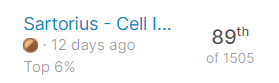
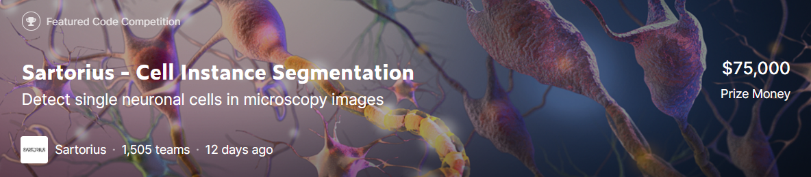

# Sartorius - Cell Instance Segmentation - Top 6% (SOLO)
 

## competition description

Neurological disorders, including neurodegenerative diseases such as Alzheimer's and brain tumors, are a leading cause of death and disability across the globe. However, it is hard to quantify how well these deadly disorders respond to treatment. One accepted method is to review neuronal cells via light microscopy, which is both accessible and non-invasive. Unfortunately, segmenting individual neuronal cells in microscopic images can be challenging and time-intensive. Accurate instance segmentation of these cells—with the help of computer vision—could lead to new and effective drug discoveries to treat the millions of people with these disorders.

Current solutions have limited accuracy for neuronal cells in particular. In internal studies to develop cell instance segmentation models, the neuroblastoma cell line SH-SY5Y consistently exhibits the lowest precision scores out of eight different cancer cell types tested. This could be because neuronal cells have a very unique, irregular and concave morphology associated with them, making them challenging to segment with commonly used mask heads.

Sartorius is a partner of the life science research and the biopharmaceutical industry. They empower scientists and engineers to simplify and accelerate progress in life science and bioprocessing, enabling the development of new and better therapies and more affordable medicine. They're a magnet and dynamic platform for pioneers and leading experts in the field. They bring creative minds together for a common goal: technological breakthroughs that lead to better health for more people.

In this competition, you’ll detect and delineate distinct objects of interest in biological images depicting neuronal cell types commonly used in the study of neurological disorders. More specifically, you'll use phase contrast microscopy images to train and test your model for instance segmentation of neuronal cells. Successful models will do this with a high level of accuracy.

If successful, you'll help further research in neurobiology thanks to the collection of robust quantitative data. Researchers may be able to use this to more easily measure the effects of disease and treatment conditions on neuronal cells. As a result, new drugs could be discovered to treat the millions of people with these leading causes of death and disability.

- 사용 프레임워크 및 라이브러리 : Pytorch, Detectron2, MMDetection, monai, albumentations

- 테스트 모델 :  MaskRCNN-ResNet-50-C4, MaskRCNN-ResNet-50-FPN, MaskRCNN-ResNet-100-C4, MaskRCNN-ResNet-100-FPN, MaskRCNN-ResNeXt-101-32x8d-FPN, Cascade_MaskRCNN_ResNeXt_152_32x8d_FPN

- **사용 프레임워크 및 라이브러리 :** Pytorch, Detectron2, MMDetection, monai, albumentations
- **테스트 모델 :** MaskRCNN-ResNet-50-C4, MaskRCNN-ResNet-50-FPN, MaskRCNN-ResNet-100-C4, MaskRCNN-ResNet-100-FPN, MaskRCNN-ResNeXt-101-32x8d-FPN, Cascade_MaskRCNN_ResNeXt_152_32x8d_FPN
- **데이터 분할 :** Stratified K-fold CrossValidation (5 fold splits)
- **데이터 전처리 :** 깨진 마스크 라벨링을 보정하기 위해 Clean Mask 작업 진행
- **데이터 증강 :** RandomCrop, ResizeShortestEdge, RandomFlip, RandomRotation, RandomSaturation, RandomBrightness, RandomContrast, RandomLighting
- **모델 앙상블 :** NMS 앙상블, NMW 앙상블
- **전이 학습 :** LIVECell 데이터를 사용하여 Pre-Train 진행
- **추론 :** TTA(Test Time Augmentation) 진행
